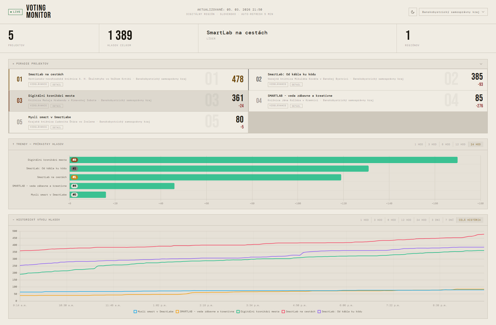

<p align="center">
  
</p>

# Voting Monitor – Digitálny región

Monitorovacia aplikácia pre hlasovanie v súťaži [digitalnyregion.sk](https://www.digitalnyregion.sk). Cron script každých 5 minút sťahuje stav hlasov z API a ukladá snapshoty. Dashboard zobrazuje aktuálne poradie projektov, trendy prírastkov a vývoj hlasov v čase.

<p align="center">
  
</p>

## Štruktúra súborov

```
monitor/
├── cron/
│   └── fetch.php          # Cron script – sťahuje API a ukladá snapshoty
├── data/
│   ├── snapshots/         # Timestampované JSON snapshoty (nie v gite)
│   ├── latest.json        # Posledný snapshot (nie v gite)
│   └── fetch.log          # Log fetchov (nie v gite)
├── docs/
│   ├── logo.svg           # SVG logo 512×512
│   └── screenshot-main.png
├── api.php                # Backend API pre AJAX volania
├── index.html             # Dashboard
├── app.js                 # Frontend logika
├── style.css              # Terminal Noir theme (dark / light)
└── favicon.svg            # SVG favicon
```

## Inštalácia

### Požiadavky

- PHP 7.4+ s `allow_url_fopen = On`
- Webserver (Apache / Nginx) alebo `php -S` pre lokálny vývoj

### Kroky

1. Skopíruj adresár `monitor/` na server do webového koreňa.

2. Over, že PHP má práva zapisovať do `data/`:
   ```bash
   chmod 755 data/
   ```

3. Spusti prvý fetch manuálne:
   ```bash
   php cron/fetch.php
   ```
   Skontroluj výstup v `data/fetch.log` a vznik `data/latest.json`.

4. Pridaj cron entry (každých 5 minút):
   ```
   */5 * * * * php /var/www/html/monitor/cron/fetch.php
   ```

5. Otvor `index.html` v browseri (cez webserver – potrebuje AJAX na `api.php`).

## API

Endpoint: `api.php?action=<akcia>`

| Akcia | Popis |
|---|---|
| `latest` | Posledný snapshot (všetky projekty + metadata) |
| `regions` | Pole unikátnych regiónov |
| `history` | História hlasov zo snapshotov |

### Parametre `history`

| Parameter | Popis | Default |
|---|---|---|
| `region` | Filter podľa kraja | (všetky) |
| `hours` | Časové okno v hodinách; `0` = celá história | `0` |

Pri `hours > 0` sa vrátia **všetky** snapshoty z daného obdobia bez sampingu.
Pri `hours = 0` (celá história) sa sampuje na max 500 bodov pre výkon.

### Príklady

```
api.php?action=latest
api.php?action=regions
api.php?action=history
api.php?action=history&region=Žilinský samosprávny kraj
api.php?action=history&region=Košický samosprávny kraj&hours=24
```

### Formát `history` odpovede

```json
{
  "timestamps": ["2026-03-05T08:00:00+00:00", "..."],
  "projects": {
    "42": {
      "title": "Názov projektu",
      "region": "Žilinský samosprávny kraj",
      "city": "Žilina",
      "category": "Digitálne zručnosti",
      "votes": [120, 125, 131]
    }
  }
}
```

## API Zdroj

- URL: `https://www.digitalnyregion.sk/api/projects?limit=100`
- Aktuálne: 25 projektov, 8 regiónov (všetky SK kraje)
- Polia projektu: `id`, `slug`, `title`, `description`, `descriptionFull`, `category`, `region`, `city`, `imageUrl`, `thumbnailUrl`, `goals`, `impact`, `votesCount`, `votingEnabled`, `isActive`, `createdAt`, `updatedAt`

## Dashboard

- **Terminal Noir** design – dark / light mode, Bebas Neue + DM Mono
- Filter podľa regiónu (dropdown), výber sa ukladá do URL hash
- Top 3 projekty: gold / silver / bronze zvýraznenie
- Rozdiel hlasov voči predchádzajúcemu projektu v poradí (červené číslo)
- Projekty s `votingEnabled: false` sú prečiarknuté a stmavnuté
- Tlačidlo **DETAIL** na každej karte – modal s obrázkom, popisom, cieľmi a dopadom projektu
- Auto-refresh každých 5 minút

### Trend chart – prírastky hlasov

Horizontálny bar chart, výška sa prispôsobuje počtu projektov. Každý bar obsahuje aktuálne poradie projektu. Časové okno: **1h / 3h / 6h / 12h / 24h** (prepočítané na počet snapshotov pri 5-min intervale).

### Line chart – historický vývoj hlasov

Vývoj absolútnych hlasov v čase. Časové okno: **1h / 3h / 6h / 12h / 24h / 3 dni / 7 dní / celá história** (default). Pre konkrétné obdobia sa vrátia skutočné body bez sampingu.

## Retencia dát

Snapshoty sa nemažú – retencia je zámerná. Pri výbere celej histórie (`hours=0`) sa sampuje na max 500 bodov pre výkon. Pri výbere konkrétneho obdobia (`hours>0`) sa vracajú všetky skutočné body.
